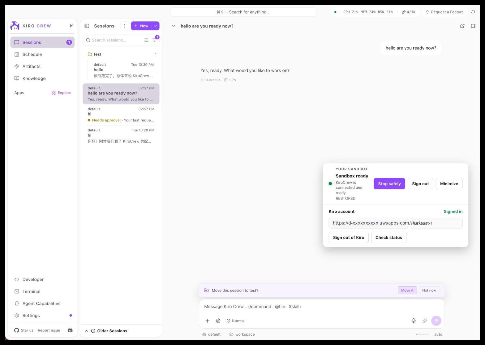
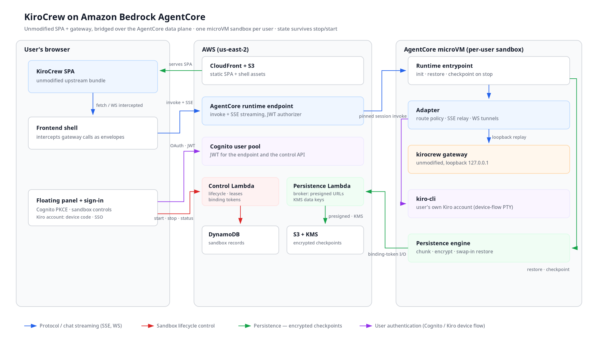

# 基于 Amazon Bedrock AgentCore 的 KiroCrew

[English](README.md) | **简体中文**

无需修改上游 KiroCrew SPA 或 Gateway，即可在隔离且可持久化的云端沙箱中运行完整的
KiroCrew 体验。

用户通过 Amazon Cognito 登录后，获得一个专属的 Amazon Bedrock AgentCore microVM，并用
自己的 Kiro 账号（Builder ID 或组织 SSO）完成授权。聊天、会话和交互式终端实时传输到浏览器；
工作区和 Kiro 登录态通过加密的 S3 检查点在沙箱重启后继续保留。



*由 AgentCore microVM 提供服务的原版 KiroCrew 控制台。右下角的悬浮面板是本项目唯一新增的
界面：沙箱生命周期、Kiro 登录，以及会先创建检查点的安全停止。*

> **示例代码，不适用于生产环境。** 本仓库是一份参考实现，用于演示如何在 Amazon Bedrock
> AgentCore 上运行 KiroCrew。它未经生产级加固、压力测试和优化，也不附带任何服务级别承诺。
> 投入生产前请自行评审并调整，尤其是认证边界、凭证处理、IAM 权限范围、成本控制和运维监控。
> 你需要对自己部署的内容的安全性与合规性负责。

> 本示例需部署到你自己的 AWS 账号。文档中出现的账号 ID、区域和域名均为占位符，请替换为
> 你自己的值。

## 目录

- [为什么需要这个项目](#为什么需要这个项目)
- [架构](#架构)
- [安全与持久化模型](#安全与持久化模型)
- [部署示例](#部署示例)
- [日常运维](#日常运维)
- [成本与清理](#成本与清理)
- [本地开发](#本地开发)
- [仓库结构](#仓库结构)

## 为什么需要这个项目

KiroCrew 原本面向本地运行：浏览器中的 SPA 通过 HTTP、服务器发送事件（SSE）和 WebSocket
与 `127.0.0.1` 上的 Gateway 通信。AgentCore 则把应用运行在远端 microVM 中，并通过数据平面
对外提供服务。本项目负责连接这两种运行模式，同时保持上游版本不变。

核心特点：

- **不维护上游分叉。** 直接使用固定版本的 KiroCrew SPA 和 Gateway 发行版。
- **每位用户一个沙箱。** Cognito 身份映射到相互隔离的 AgentCore 会话。
- **保留原生流式体验。** SSE 聊天输出和终端 WebSocket 原始帧都增量转发，不做整段缓冲。
- **工作区可持久化。** 停止时创建加密检查点，启动时恢复最近一次完整提交的数据版本。
- **Kiro 身份归用户所有。** 每位用户用自己的账号登录 `kiro-cli`，登录态随检查点一起保存；
  部署环境不持有任何共享的服务身份。

## 架构



[打开 SVG 矢量图](docs/architecture.svg)

一次请求会依次经过以下环节：

1. **登录与沙箱控制。** 悬浮面板使用 Cognito PKCE 登录。控制 Lambda 创建或恢复用户的沙箱
   记录，管理租约，并签发短期绑定令牌。
2. **拦截 Gateway 调用。** 前端 Shell 拦截原版 SPA 发往本地回环地址的 HTTP、SSE 和
   WebSocket 请求，并编码成协议信封。
3. **通过 AgentCore 传输。** 协议信封经 AgentCore Runtime Endpoint 发送到 microVM；VM 内
   的 Adapter 按 JSON Schema 契约校验信封，并应用路由策略。
4. **在 VM 内重放。** Adapter 把请求重放到 `127.0.0.1` 上真正的 `kirocrew gateway`，再把
   响应、SSE 事件或 WebSocket 帧实时传回浏览器。
5. **创建检查点与恢复。** 持久化引擎切分并加密工作区，以版本（generation）形式提交到 S3：
   在 **Stop safely** 时、Kiro 登录/登出后、工作区有变化的周期性间隔、后台任务由忙转闲时，
   以及收到 SIGTERM 时都会提交。再次启动时先恢复最新版本，再启动 Gateway。

图中 **蓝色** 表示协议与聊天流，**红色** 表示沙箱生命周期控制，**绿色** 表示持久化，
**紫色** 表示用户认证。

## 安全与持久化模型

- **租户隔离由传输层保证，而不是靠路由过滤。** AgentCore 对每次调用校验 Cognito JWT，
  Adapter 再把绑定令牌与 Cognito subject 比对。沙箱是单租户 microVM。
- **路由策略。** 上游全部路由默认隧穿。只有会签发 Gateway 自身凭证（`/api/token`）或抢夺
  Gateway 生命周期（`/api/shutdown`）的路由被拒绝；microVM 中不可能存在的宿主机原生功能返回
  `501`。策略固化在 `contracts/kirocrew/0.3.0-route-allowlist.json`，由契约测试同时约束
  Python Adapter 和 TypeScript Shell。
- **绑定令牌** 授权 VM 内的持久化 Broker，有效期 30 分钟；沙箱租约存活期间会透明续签，
  长时间打开的页面不会因此失效，也不会轮换会话。
- **检查点** 使用每个沙箱独立的 KMS 数据密钥，以版本（generation）形式提交到 S3。保留最近
  两个版本，并由离线审计任务校验完整性。
- **恢复** 在 microVM 容器盘上工作区内部的 `.agentcore/` 下暂存，并行预取数据块，逐项换入
  目标位置，支持失败回滚。工作区所在的容器盘是临时的：加密的 S3 检查点是唯一的持久层。
- **Kiro 登录** 以设备码流程在沙箱 PTY 中完成。Kiro CLI 把登录态保存在
  `~/.local/share/kiro-cli`，该目录属于检查点范围，因此恢复后的沙箱仍处于已登录状态。
- **Gateway 就绪探测** 以 Gateway 自身的就绪输出为主，并以健康检查端点作为回退，即使 Gateway
  在加载模型期间吞掉了自己的标准输出，恢复后的沙箱也能正常就绪。运行期间 Gateway 若意外退出，
  Runtime 会自动重启它；检查点只在内存快照阶段冻结 Gateway，不会触发其事件循环卡死看门狗。

完整的持久化契约见 [docs/persistence.md](docs/persistence.md)。

## 部署示例

### 环境要求

- 一个 AWS 账号，以及一个已提供 Amazon Bedrock AgentCore Runtime 的区域。
- 已配置凭证的 AWS CLI v2，凭证需能创建 Cognito、CloudFront、S3、Lambda、DynamoDB、KMS、
  ECR、IAM 和 AgentCore 资源。
- Terraform 1.9 或更高版本。
- 支持 buildx 的 Docker，且 builder 能构建 `linux/amd64` 与 `linux/arm64` 镜像（远端 arm64
  节点或 QEMU 模拟均可）。
- Python 3.12 与 [`uv`](https://docs.astral.sh/uv/)，Node.js 22 与 npm 10。
- 每位最终用户需要自己的 Kiro 账号（Builder ID 或组织 SSO）。

### 1. 安装依赖并构建前端

```bash
make setup                 # 锁定版本的 Python 与 Node 依赖
make frontend-assets       # 提取固定版本的上游 KiroCrew SPA
npm run build:bootstrap    # 构建 frontend-shell/dist/bootstrap.bundle.js
```

Terraform 会读取该 Bundle，并在上传 `bootstrap.js` 时把部署配置注入到首行，因此每次
`apply` 前都要先构建。

### 2. 创建容器镜像仓库

Runtime 镜像存放在由 Terraform 创建的 ECR 仓库中。先单独应用该模块，确保推送镜像前仓库已
存在：

```bash
export AWS_REGION=us-east-2
export TF_STATE=$PWD/infrastructure/terraform.tfstate   # 已被 git 忽略
terraform -chdir=infrastructure init -backend=false
terraform -chdir=infrastructure apply -state="$TF_STATE" \
  -var="aws_region=$AWS_REGION" -target=module.runtime_common
```

### 3. 发布 Runtime 镜像

镜像必须低于 AgentCore 的 2 GB 限制；`make image-inspect` 会检查该限制及预装开发工具链。
非 root 沙箱终端内包含：

- Python 3.12，以及 `pip`、`uv` 和 `uvx`。
- Node.js 22.23.1，以及 npm 10.9.8、`npx` 和 Corepack。
- `git`、Git LFS、GitHub CLI（`gh`）和 OpenSSH 客户端。
- GCC/G++、`make` 和 `pkg-config`，可构建 Python 与 Node 原生扩展。
- `curl`、`jq`、`rg`、`fd`、`tree`、`file`、`rsync`、netcat、压缩工具和轻量编辑器等常用终端工具。

大型语言 SDK 和数据库仍由各项目自行安装，以控制基础镜像大小。

```bash
make image-publish \
  IMAGE_RELEASE_TAG=0.3.0-microvm-r1 \
  EXPECTED_AWS_ACCOUNT_ID=<AWS_ACCOUNT_ID> \
  AWS_REGION=$AWS_REGION \
  ECR_REPOSITORY_URI=<AWS_ACCOUNT_ID>.dkr.ecr.$AWS_REGION.amazonaws.com/kirocrew-agentcore-dev-runtime
```

输出的最后一行是不可变的镜像引用，记下其中的 `sha256:` 摘要。

### 4. 部署整套资源

```bash
export TF_VAR_runtime_image_digest=sha256:<第 3 步得到的摘要>
make infra-deploy EXPECTED_AWS_ACCOUNT_ID=<AWS_ACCOUNT_ID> AWS_REGION=$AWS_REGION
terraform -chdir=infrastructure output -state="$TF_STATE" deployment
```

`deployment` 输出中包含 CloudFront 地址。打开它，直接在悬浮面板里注册账号：注册与登录都经
过一个受限的 Lambda 网关，只接受 `allowed_email_domains` 变量所列域名（默认 `amazon.com`）
的邮箱；域名之外的个别地址可通过 `allowed_email_patterns`（对完整地址匹配的正则列表）放行。
新账号需要输入发送到邮箱的验证码完成确认，表单支持重新发送。任何人都无法绕过该网关直接对
Cognito 注册或登录。登录后点击 **Start**。新沙箱首次启动约需一分钟，之后每次启动都会在数秒
内恢复检查点。

## 日常运维

- **更新 Runtime。** 发布新镜像（第 3 步），然后带上新的 `TF_VAR_runtime_image_digest`
  运行 `make infra-deploy`。Terraform 会创建新的 AgentCore Runtime 版本并把线上 Endpoint 切
  过去。旧版本上的温热会话会被回收；切换期间重连的用户可能短暂看到
  **Sandbox needs attention**，点击 **Start sandbox**（或用 **Reload** 控件重新加载页面）即可重连。
- **更新前端。** 重新构建 Bundle（`npm run build:bootstrap`）并运行 `make infra-deploy`。
  Terraform 会重新上传 `bootstrap.js`；随后在 `deployment` 输出所指的 CloudFront 分发上失效
  `/bootstrap.js`。
- **停止与启动。** **Stop safely** 会创建检查点并释放计算资源；**Start** 恢复最近一次提交
  的版本。空闲超过 `runtime_idle_session_timeout_seconds`（默认 15 分钟）的沙箱会被
  AgentCore 缩容到零。任务运行器、子代理或工作流仍在工作的沙箱会上报"忙碌"，即使浏览器已
  断开也会越过该超时继续存活；工作结束时提交一次检查点并恢复正常的空闲回收。卡在忙碌状态的
  任务会在 `KIROCREW_BUSY_MAX_SECONDS`（默认 4 小时）后被切断，避免把 microVM 一直占到
  8 小时的会话上限。
- **观测。** Runtime 自己的日志（Adapter、Supervisor、检查点引擎）直接写入 Terraform 创建的
  `/aws/bedrock-agentcore/<prefix>` CloudWatch 日志组；平台托管的 vended 日志组只有访问日志。
  控制面、持久化和认证日志在三个 Lambda 的日志组。CloudWatch 告警可通过 `alarm_actions` 变量
  接入通知。完整运维手册（日志位置、生命周期不变量、已知故障模式）见
  [docs/operations.md](docs/operations.md)。

## 成本与清理

整套资源包括 AgentCore Runtime 会话（按活跃会话计费）、两个 Lambda 函数、一张 DynamoDB
表、S3 检查点存储、每个部署一把 KMS 密钥，以及一个 CloudFront 分发。空闲沙箱会缩容到零，
但检查点和分发会一直存在，直到销毁整套资源。

```bash
terraform -chdir=infrastructure destroy -state="$TF_STATE" -var="aws_region=$AWS_REGION"
```

`retain_persisted_data`（默认 `true`）会在销毁时保留加密检查点、KMS 密钥和沙箱元数据；
设为 `false` 则全部删除。

## 本地开发

```bash
make setup
make verify
```

`make verify` 会执行锁文件、格式、静态检查、类型、单元测试、契约测试和 Terraform 验证。
Python 单元测试要求行覆盖率和分支覆盖率均为 100%。单项命令：

```bash
make format-check          # 检查 Python、TypeScript 和 Terraform 格式
make lint                  # ruff、Bandit、ESLint 和密钥扫描
make typecheck             # mypy 和 TypeScript 编译器
make unit                  # Python 单元测试 + Vitest
make contract              # 生成物检查 + 跨语言契约测试
make terraform-validate    # 初始化并验证 Terraform
npm run test:playwright    # 前端 Shell 浏览器测试
```

### 修改协议或路由策略

协议 Schema 是事实来源。修改 `contracts/schemas/*.json` 及 Adapter 中对应的 Schema 副本
后，重新生成 Python 和 TypeScript 模型：

```bash
uv run python tools/generate_protocol_models.py
```

路由策略变更必须在 Python Adapter（`adapter/src/kirocrew_agentcore_adapter/loopback.py`）、
TypeScript Shell（`frontend-shell/src/remote-transport.ts`）以及 `contracts/kirocrew/` 和
`frontend-shell/upstream-contracts/` 下的两份契约夹具之间保持一致。契约测试会检查这一致性，
并确保固定版本的上游 Bundle 中出现的每个 API 路径都已分类。

### 测试策略

- **单元测试：** 覆盖所有 Python 模块，并设置 100% 行覆盖率与分支覆盖率门禁；前端行为由
  Vitest 覆盖。
- **契约测试：** 用 Python 模型校验 TypeScript 序列化结果，检查代码生成物、上游 Bundle 摘要
  及路由覆盖情况。
- **浏览器测试：** Playwright 覆盖面板状态、拖动、设备码登录，以及“错误不能锁住页面”这一要求。
- **端到端测试：** `tests/e2e/` 仅在设置 `DEPLOYMENT_MODE` 后对已部署环境运行。

## 仓库结构

| 路径 | 职责 |
|---|---|
| `frontend-shell/` | Cognito PKCE、生命周期界面、Gateway 调用拦截、远程传输及上游 SPA 契约固定 |
| `adapter/` | 协议校验、回环路由策略、HTTP/SSE/WebSocket 隧道及 Kiro 身份操作 |
| `runtime/` | AgentCore 入口、会话初始化、Gateway 监管与自动重启、请求处理及检查点调度 |
| `infrastructure/` | CloudFront、S3、Cognito、Lambda、DynamoDB、KMS、ECR 和 AgentCore 的 Terraform 配置 |
| `infrastructure/functions/control/` | 沙箱生命周期、租约、状态流转和绑定令牌 |
| `infrastructure/functions/persistence/` | 分块加密的检查点/恢复引擎及 Lambda Broker |
| `contracts/` | JSON Schema、OpenAPI/AsyncAPI、路由策略和上游兼容性固定信息 |
| `tests/` | 单元测试、跨语言契约测试、已部署环境端到端测试和浏览器 UI 测试 |
| `tools/` | 协议代码生成、上游 SPA 提取、Terraform 包装脚本和镜像工具 |
| `docs/` | 架构图源文件、截图和持久化契约 |
| `CLAUDE.md`（`AGENTS.md`） | 编码 Agent 上手指南：构建/验证/部署命令与承重不变量 |

## 安全

如何报告安全问题，请参阅 [CONTRIBUTING](CONTRIBUTING.md#security-issue-notifications)。

## 许可证

本项目采用 MIT-0 许可证，详见 LICENSE 文件。
