# KiroCrew on AgentCore User Guide

**English** | [简体中文](README.zh-CN.md)

This guide is for first-time users. It follows the order you actually perform the steps: create an account, sign in, start your sandbox, connect your Kiro account, and start the first session. It also explains what every button on the page does. All screenshots come from a real deployment.

> You need: the access address your deployment operator gave you (an `https://` link), an email address the deployment accepts, and a Kiro account (Builder ID or your organization's SSO).

## Contents

1. [Open the page](#1-open-the-page)
2. [Create an account](#2-create-an-account)
3. [Sign in](#3-sign-in)
4. [Start the sandbox](#4-start-the-sandbox)
5. [Sign in to Kiro](#5-sign-in-to-kiro)
6. [Start your first session](#6-start-your-first-session)
7. [Panel controls](#7-panel-controls)
8. [Stopping and signing out](#8-stopping-and-signing-out)
9. [Troubleshooting](#9-troubleshooting)

## 1. Open the page

Open the address in your browser. On the first visit, KiroCrew's own two welcome dialogs appear first:

**Privacy**: explains the anonymous telemetry. Click **Continue** in the lower right.

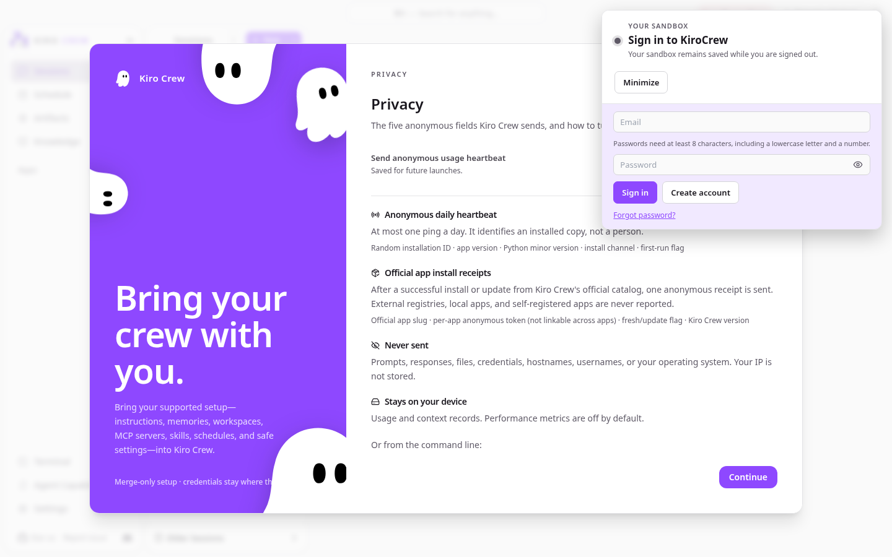

**Customize**: theme and color scheme. Click **Skip all** in the upper right; everything here can be changed later in Settings.

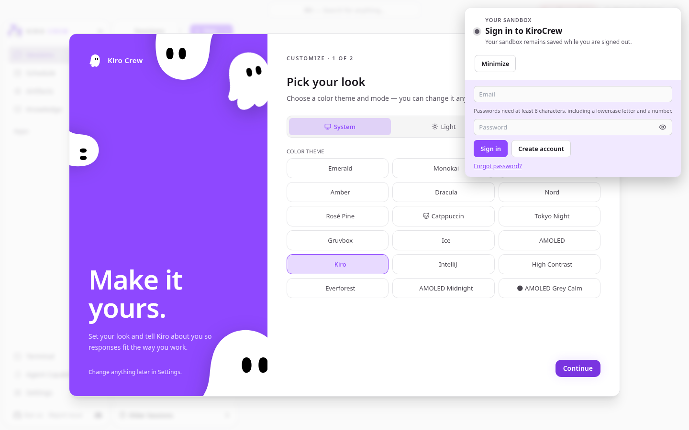

With the dialogs closed, the floating panel in the upper right is the **sandbox control panel** this project adds. It always floats above the KiroCrew page and can be dragged. Right now its title is **Sign in to KiroCrew**, with the sign-in form below it.

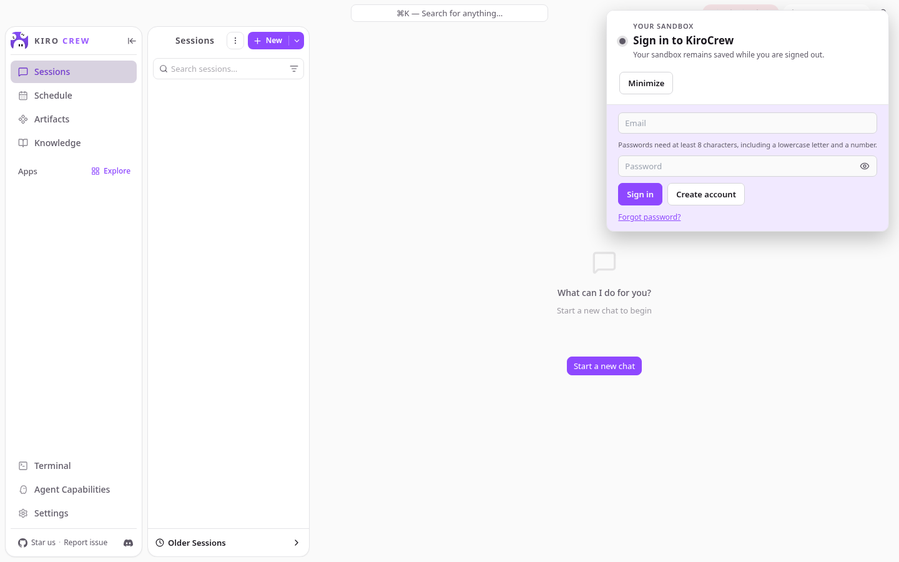

## 2. Create an account

1. Enter your address in **Email** and a password in **Password**. The rule is printed above the form: at least 8 characters, including a lowercase letter and a number. The eye icon shows or hides the password.
2. Click **Create account**.

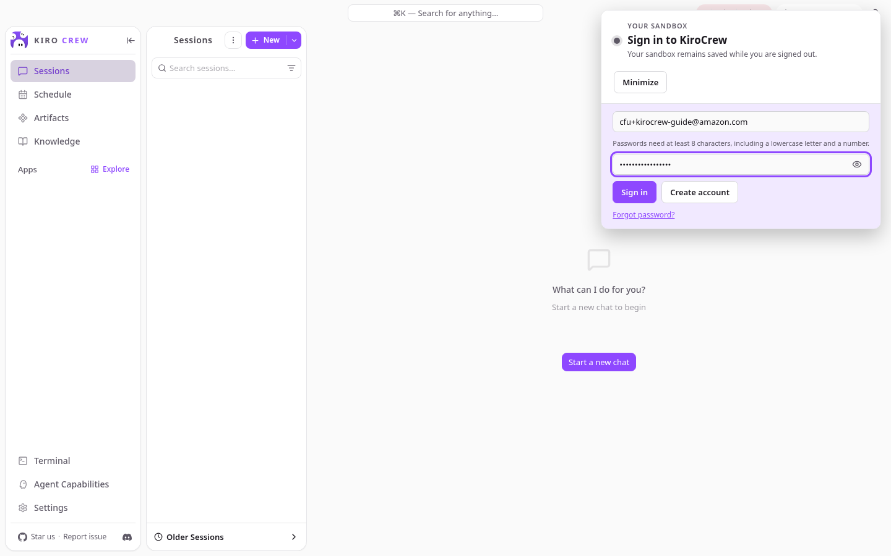

3. The page says "We emailed a code to …". Check your inbox for a message titled **Your verification code** from `no-reply@verificationemail.com` (usually within a minute; it may carry an [EXTERNAL] prefix).

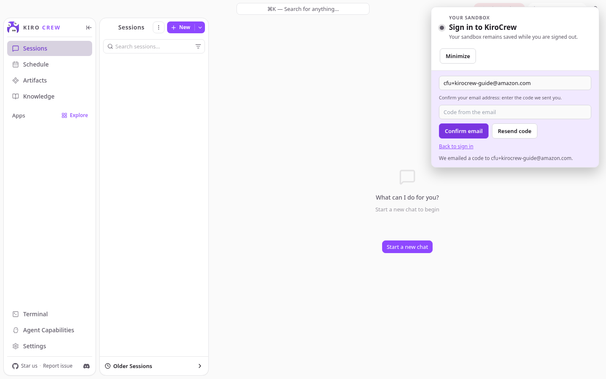

4. Type the six-digit code into **Code from the email** and click **Confirm email**. **Resend code** sends a new one; **Back to sign in** returns to the form.

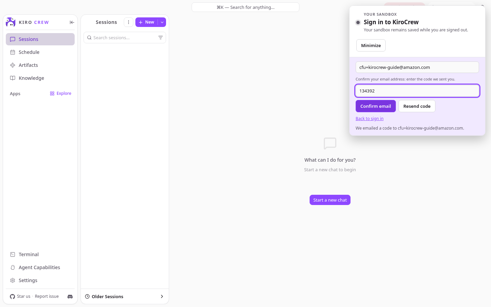

Confirmation signs you in automatically and the panel title becomes **Sandbox stopped**.

If your address is not allowed, Create account fails immediately; ask the deployment operator to add your address to the allow list.

## 3. Sign in

With an existing account, enter email and password in the same form and click **Sign in** (Enter in the password field also works).

- The session is kept in the browser: closing the tab and coming back does not ask for the password again. Only **Sign out** on the panel ends it.
- Forgot your password: **Forgot password?** → enter your email → **Send code** → enter the emailed code and a new password → **Reset password**.

After signing in the panel looks like this. `Sandbox stopped` means your sandbox exists but is not running; the workspace saved last time is ready to restore.

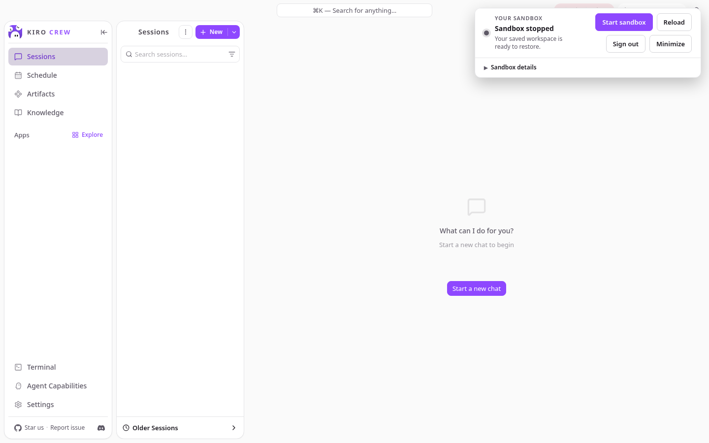

## 4. Start the sandbox

Click **Start sandbox**. The panel shows three steps with elapsed time: Requesting compute → Restoring workspace → Starting KiroCrew.

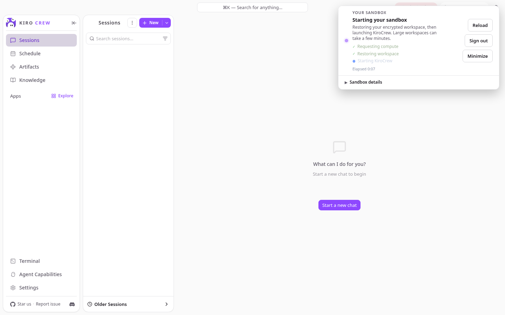

The first start takes about a minute; later starts only restore a checkpoint and usually take around 20 seconds. When ready, the panel collapses into a small **Sandbox** pill in the upper right with a green dot, and KiroCrew's own header switches to **Gateway connected**.

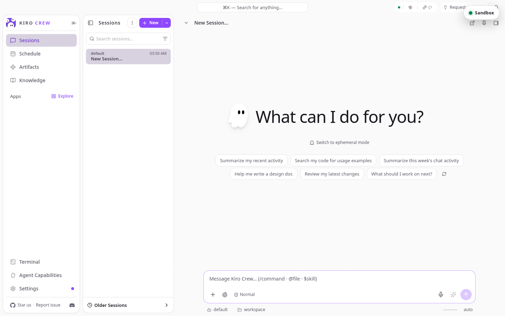

Click the pill to expand the panel again; the title reads **Sandbox ready**.

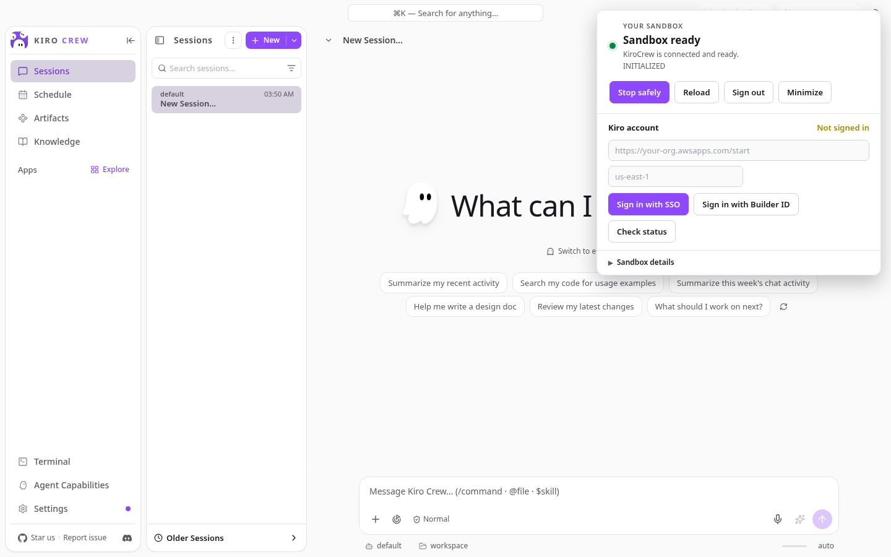

Expand **Sandbox details** to see the microVM uptime, recent state changes, and the **persisted paths**. Only files under these paths survive stop and restart; everything else is ephemeral:

```
/mnt/workspace/home/.kiro
/mnt/workspace/home/.config
/mnt/workspace/home/.local/share/kiro-cli
/mnt/workspace/artifacts
/mnt/workspace/knowledge
/mnt/workspace/memory
/mnt/workspace/projects
/mnt/workspace/user
```

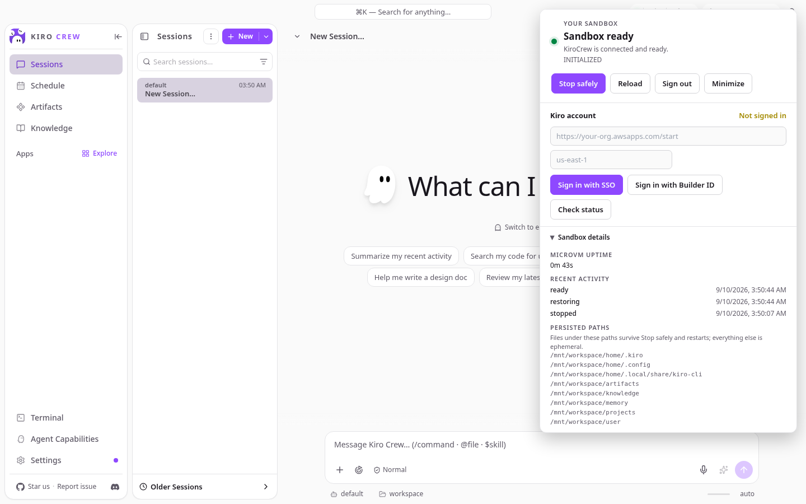

## 5. Sign in to Kiro

Once the sandbox is ready, the **Kiro account** section in the middle of the panel shows **Not signed in**. KiroCrew calls models with your own Kiro account. You do this once; the sign-in is saved with your workspace.

Two options:

- **Sign in with Builder ID**: a personal AWS Builder ID.
- **Sign in with SSO**: your organization's IAM Identity Center. Fill in the Start URL (like `https://your-org.awsapps.com/start`) and Region in the two fields above the buttons first.

Clicking either shows a **Kiro sign-in required** section with a code and a verification address:

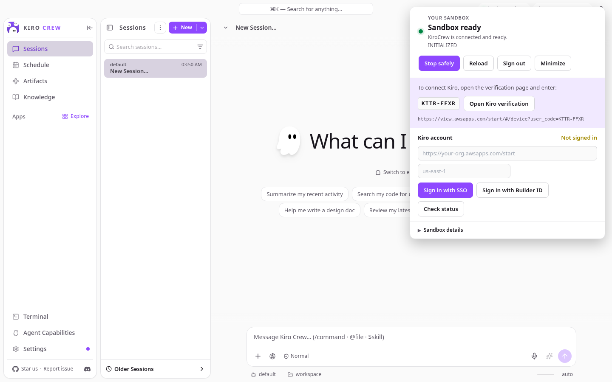

1. Click **Open Kiro verification** (or copy the address) to open it in a new tab.
2. Sign in with your Builder ID or SSO account, check that the code on that page matches the panel, and allow it.
3. Back on this page, the panel updates to **Signed in** within a few seconds (**Check status** refreshes it on demand). The code is valid for about 10 minutes; if it expires, click the sign-in button again.

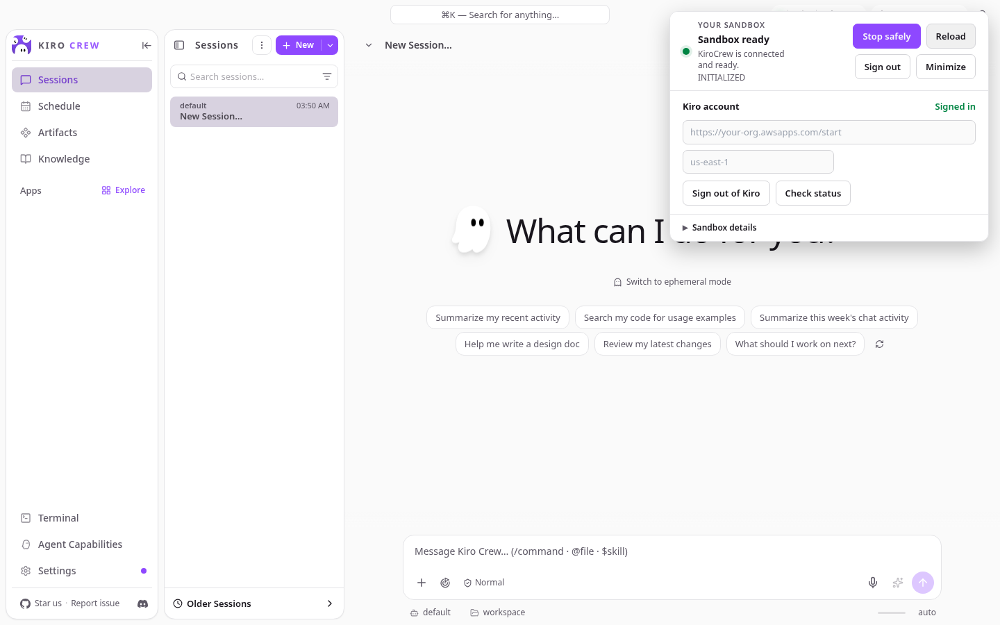

The panel collapses on its own after sign-in. **Sign out of Kiro** disconnects only the Kiro account; the sandbox and your KiroCrew sign-in are unaffected.

## 6. Start your first session

With the panel collapsed you have the full KiroCrew interface. Click **+ New** in the **Sessions** column, or type in the composer at the bottom and press Enter.

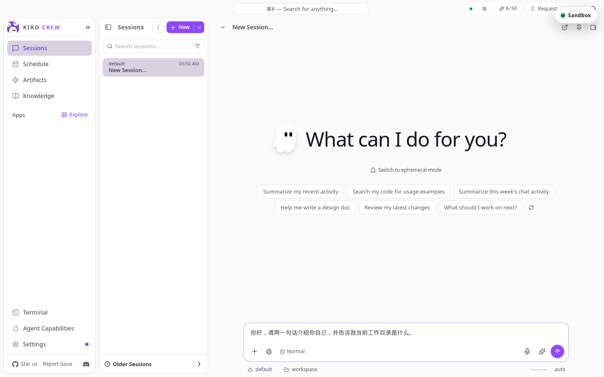

From here on, everything works like a locally run KiroCrew: sessions, Schedule, Artifacts, Knowledge, Terminal, and so on are in the left navigation. Conversations and files live in your own sandbox; other users cannot see them.

## 7. Panel controls

The floating panel shows different buttons depending on state:

| Button | When shown | What it does |
|---|---|---|
| **Sign in / Create account** | Signed out | Sign in to, or register, a KiroCrew account |
| **Forgot password?** | Signed out | Reset the password with an emailed code |
| **Start sandbox** | Sandbox stopped, or in an error state | Request compute and restore the most recent saved workspace |
| **Stop safely** | Sandbox running | Save an encrypted checkpoint first, then release compute. Use this to stop; do not just close the page |
| **Response in progress** | A reply is being generated | Disabled form of Stop safely; stop after the reply finishes |
| **Retry safely / Check connection** | Connection lost | Re-establish the connection without resubmitting a request that was already accepted |
| **Reload** | Signed in | Reload the page and reconnect without stopping the sandbox |
| **Sign out** | Signed in | Sign out of KiroCrew in this browser. The sandbox and its data remain; sign in again to continue |
| **Minimize** | Panel expanded | Collapse to the pill in the upper right; click the pill to expand |
| **Sign in with SSO / Builder ID** | Kiro not signed in | Start Kiro device authorization |
| **Sign out of Kiro** | Kiro signed in | Disconnect the Kiro account |
| **Check status** | Sandbox running | Re-check the Kiro sign-in state |
| **Sandbox details** | Signed in | Show uptime, state history, and persisted paths |

Panel titles and what they mean:

| Title | Meaning |
|---|---|
| Sign in to KiroCrew | Signed out |
| Sandbox stopped | Signed in, sandbox not running; Start is available |
| Starting your sandbox | Starting; watch the three-step progress |
| Sandbox ready | Running; KiroCrew is usable |
| KiroCrew is responding | A reply is being generated |
| Saving and stopping | Writing a checkpoint and stopping |
| Reconnecting | Connection lost; reconnecting automatically |
| Workspace is read-only | Checkpointing failed; existing data is protected, new changes are not persisted for now |
| Sandbox needs attention | An error; read the message under the title. Start sandbox or Reload usually recovers |

## 8. Stopping and signing out

- **Click Stop safely when you are done.** It writes the workspace to an encrypted checkpoint before releasing compute; the next Start restores exactly that state. Stopping takes from about 10 seconds to a minute depending on workspace size.
- Forgetting is not fatal: an idle sandbox is reclaimed after 15 minutes, and a running sandbox checkpoints itself every few minutes, so at most a few minutes of changes are lost. If background work is running, the sandbox stays up until it finishes.
- **Sign out** only ends the sign-in in this browser; it does not stop the sandbox.

## 9. Troubleshooting

**"Email not allowed" on registration**: ask the deployment operator to add your address to the allow list.

**No verification code**: check spam. The subject is "Your verification code", the sender `no-reply@verificationemail.com`; click Resend code.

**Sandbox needs attention**: click **Reload** first; if that does not help, **Start sandbox**. Your data is in the checkpoint and is not lost by restarting.

**Slow replies or Gateway offline**: the sandbox may still be cold-starting; wait for the panel to show Sandbox ready. If the panel is ready but the page still shows offline, click Reload.
