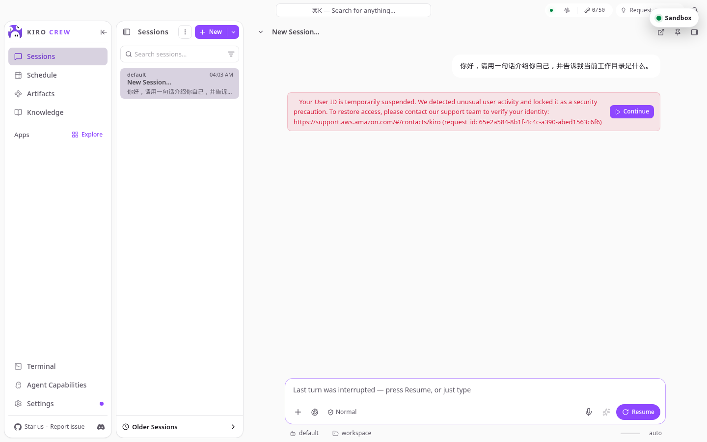

# KiroCrew on AgentCore 使用手册

[English](README.md) | **简体中文**

本手册面向第一次使用的用户，按实际操作顺序介绍：注册账号、登录、启动沙箱、登录 Kiro 账号、开始第一个会话，以及页面上每个按钮的作用。所有截图均来自真实部署环境。

> 你需要准备：部署方提供的访问地址（一个 `https://` 链接）、一个允许注册的邮箱（默认只允许 `@amazon.com`，部署方可放开其他地址），以及一个 Kiro 账号（Builder ID 或组织 SSO）。

## 目录

1. [打开页面](#1-打开页面)
2. [注册账号](#2-注册账号)
3. [登录](#3-登录)
4. [启动沙箱](#4-启动沙箱)
5. [登录 Kiro 账号](#5-登录-kiro-账号)
6. [开始第一个会话](#6-开始第一个会话)
7. [面板按钮说明](#7-面板按钮说明)
8. [停止与退出](#8-停止与退出)
9. [常见问题](#9-常见问题)

## 1. 打开页面

在浏览器中打开部署方提供的地址。第一次打开时，KiroCrew 自带的两个欢迎弹窗会先出现：

**隐私说明**：介绍匿名遥测的内容，点击右下角 **Continue** 即可。


**个性化设置**：选择主题和配色。这一步可以直接点右上角 **Skip all** 跳过，以后在 Settings 里随时修改。


关闭弹窗后，右上角的浮动面板就是本项目新增的**沙箱控制面板**。它始终悬浮在 KiroCrew 页面之上，可以拖动位置。此时面板标题为 **Sign in to KiroCrew**，下方是登录表单。


## 2. 注册账号

1. 在 **Email** 输入邮箱，在 **Password** 输入密码。密码要求写在表单上方：至少 8 位，包含一个小写字母和一个数字。右侧的眼睛图标可以显示或隐藏密码。
2. 点击 **Create account**。


3. 页面提示 "We emailed a code to …"。到邮箱查收一封主题为 **Your verification code** 的邮件（发件人 `no-reply@verificationemail.com`，通常 1 分钟内送达，可能带有 [EXTERNAL] 前缀）。


4. 把邮件里的 6 位数字填入 **Code from the email**，点击 **Confirm email**。没收到可以点 **Resend code** 重发；点错了可以 **Back to sign in** 返回。


确认成功后会自动登录，面板标题变成 **Sandbox stopped**。

如果邮箱不在允许范围内，点击 Create account 会直接报错，需要联系部署方把你的邮箱加入允许列表。

## 3. 登录

已有账号时，在同一个表单输入邮箱和密码，点击 **Sign in**（在密码框按回车也可以）。

- 登录状态会保存在浏览器中，关闭标签页再打开不需要重新登录；点面板上的 **Sign out** 才会退出。
- 忘记密码：点 **Forgot password?** → 输入邮箱 → **Send code** → 填入邮件里的验证码和新密码 → **Reset password**。

登录成功后的面板如下，`Sandbox stopped` 表示你的沙箱已存在但当前没有在运行，之前保存的工作区随时可以恢复。


## 4. 启动沙箱

点击 **Start sandbox**。面板会显示三步进度：Requesting compute（申请计算资源）→ Restoring workspace（恢复加密工作区）→ Starting KiroCrew（启动 KiroCrew），并显示已用时间。


首次启动约 1 分钟；之后的启动只需恢复检查点，通常 20 秒左右。就绪后面板自动收起成右上角的小圆片 **Sandbox**，绿点表示运行中；页面顶部 KiroCrew 自己的状态也会变成 **Gateway connected**。


点击圆片可以重新展开面板，标题为 **Sandbox ready**。


展开 **Sandbox details** 可以看到微虚拟机运行时长、最近的状态变化，以及**会被持久保存的路径**。只有这些路径下的文件会在停止和重启之间保留，其他位置都是临时的：

```
/mnt/workspace/home/.kiro
/mnt/workspace/home/.config
/mnt/workspace/home/.local/share/kiro-cli
/mnt/workspace/artifacts
/mnt/workspace/knowledge
/mnt/workspace/memory
/mnt/workspace/projects
/mnt/workspace/user
```


## 5. 登录 Kiro 账号

沙箱就绪后，面板中部的 **Kiro account** 区域显示 **Not signed in**。KiroCrew 需要用你自己的 Kiro 账号调用模型，这一步只需做一次，登录状态会随工作区一起保存。

两种方式：

- **Sign in with Builder ID**：个人 AWS Builder ID。
- **Sign in with SSO**：组织的 IAM Identity Center。先在上方两个输入框填入组织的 Start URL（形如 `https://your-org.awsapps.com/start`）和 Region，再点按钮。

点击后面板出现 **Kiro sign-in required** 区域，给出一个验证码和验证页地址：


1. 点击 **Open Kiro verification**（或复制下方地址）在新标签页打开。
2. 用你的 Builder ID / SSO 账号登录，确认页面显示的代码与面板一致，点击允许。
3. 回到本页面，面板会在几秒内自动更新为 **Signed in**（也可以点 **Check status** 主动刷新）。验证码约 10 分钟有效，过期后重新点一次登录按钮即可。


登录后面板会自动收起。**Sign out of Kiro** 只断开 Kiro 账号，不影响沙箱和 KiroCrew 登录。

## 6. 开始第一个会话

面板收起后就是完整的 KiroCrew 界面。点左侧 **Sessions** 栏的 **+ New**，或直接在底部输入框输入内容，回车发送。


之后的用法与本地运行的 KiroCrew 完全一致：会话、Schedule、Artifacts、Knowledge、Terminal 等功能都在左侧导航。所有对话和文件都在你自己的沙箱里，其他用户看不到。

## 7. 面板按钮说明

浮动面板会根据状态显示不同按钮：

| 按钮 | 出现时机 | 作用 |
|---|---|---|
| **Sign in / Create account** | 未登录 | 登录或注册 KiroCrew 账号 |
| **Forgot password?** | 未登录 | 通过邮件验证码重置密码 |
| **Start sandbox** | 沙箱已停止，或处于错误状态 | 申请计算资源并恢复最近一次保存的工作区 |
| **Stop safely** | 沙箱运行中 | 先保存一份加密检查点，再释放计算资源。需要停用时请用它，不要直接关页面 |
| **Response in progress** | 正在生成回复 | Stop safely 的禁用态，等回复结束后再停止 |
| **Retry safely / Check connection** | 连接中断 | 重新建立连接；不会重复发送已经被接受的请求 |
| **Reload** | 已登录 | 刷新页面并重连沙箱，不会停止沙箱 |
| **Sign out** | 已登录 | 退出 KiroCrew 登录。沙箱和数据保留，下次登录可继续 |
| **Minimize** | 面板展开时 | 收起为右上角圆片；点圆片重新展开 |
| **Sign in with SSO / Builder ID** | Kiro 未登录 | 发起 Kiro 设备授权 |
| **Sign out of Kiro** | Kiro 已登录 | 断开 Kiro 账号 |
| **Check status** | 沙箱运行中 | 重新检查 Kiro 登录状态 |
| **Sandbox details** | 已登录 | 展开运行时长、状态历史和持久化路径 |

面板标题对应的状态：

| 标题 | 含义 |
|---|---|
| Sign in to KiroCrew | 未登录 |
| Sandbox stopped | 已登录，沙箱未运行，可以 Start |
| Starting your sandbox | 启动中，看下方三步进度 |
| Sandbox ready | 运行中，KiroCrew 可用 |
| KiroCrew is responding | 正在生成回复 |
| Saving and stopping | 正在保存检查点并停止 |
| Reconnecting | 连接中断，正在自动重连 |
| Workspace is read-only | 检查点保存失败，已有数据受保护，新改动暂时不会持久化 |
| Sandbox needs attention | 出错，看标题下方的具体信息，通常点 Start sandbox 或 Reload 可恢复 |

## 8. 停止与退出

- **用完请点 Stop safely**。它会先把工作区写成加密检查点再释放资源，下次 Start 恢复到停止时的状态。停止过程约 10 秒到 1 分钟，视工作区大小而定。
- 忘记停止也没关系：沙箱空闲 15 分钟后会自动回收；运行中每隔几分钟会自动保存检查点，最多丢失几分钟的改动。如果有后台任务在跑，沙箱会保持运行直到任务结束。
- **Sign out** 只是退出这台浏览器的登录，不停止沙箱。

## 9. 常见问题

**注册时提示邮箱不允许**：部署默认只接受 `@amazon.com`。请部署方在 `allowed_email_domains` 或 `allowed_email_patterns` 里加上你的邮箱。

**没收到验证码**：检查垃圾邮件，邮件主题是 "Your verification code"，发件人 `no-reply@verificationemail.com`；点 Resend code 重发。

**Kiro 登录后发消息报 "Your User ID is temporarily suspended"**：这是 Kiro 服务端对该 Builder ID 的临时风控，与本部署无关。按提示联系 Kiro 支持，或换一个 Kiro 账号：先点 **Sign out of Kiro**，再用另一账号登录。



**Sandbox needs attention**：先点 **Reload**；仍不行就点 **Start sandbox**。数据保存在检查点里，不会因为重新启动丢失。

**回复很慢或 Gateway offline**：沙箱可能正在冷启动，等待面板变为 Sandbox ready。如果面板已就绪但页面仍显示离线，点 Reload。
